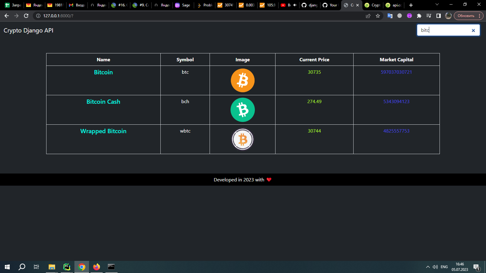

# WEB_Cryptocurrency
### Приложение парсит API www.coingecko.com и выводит данные на главную страницу.
#### Установка:
* Склонировать репозиторий: git clone git@github.com:ddr533/Cryptocurrency_WEB.git 
* Установить и активировать виртуальное окружение в папке с приложением:
  * python -m venv venv
  * cd venv/sripts/activate
* Установить зависимости из файла requirements.txt: pip install -r requirements.txt
* Перейти в папку webcrytocurrency  и запустить проект: python manage.py runserver 

